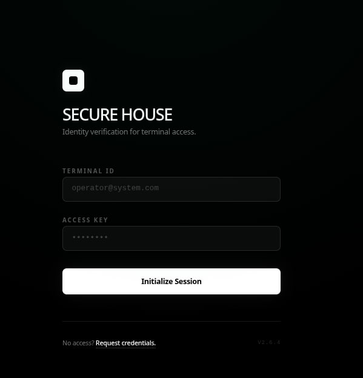
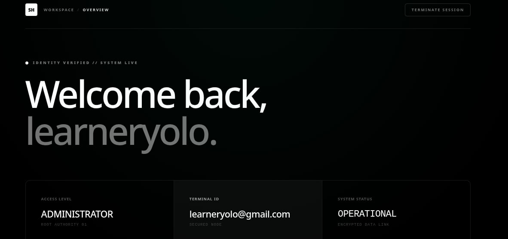

# SecureAuthFlow — High-Performance Identity Engine (2026 Edition)

SecureAuthFlow is a next-generation authentication system built with the latest **React 19** and **Vite 8** ecosystem. It features a robust security architecture powered by **Supabase** and a high-speed developer toolchain.




## 🚀 2026 Tech Stack & Performance
This project utilizes an elite-tier toolchain focused on execution speed and code quality:
- **React 19:** Leveraging the latest concurrent rendering and hook stability.
- **Supabase:** Backend-as-a-Service for industrial-grade Auth and JWT management.
- **Tailwind CSS v4:** Using the new high-performance, CSS-first engine.
- **Oxlint Integration:** Utilizing the Rust-powered linter for 100x faster code analysis than traditional ESLint, ensuring zero-config quality control.
- **TanStack Query v5:** Advanced server-state management with intelligent caching.

## 🧠 Technical Architecture

### 1. Centralized Security Middleware (Context API)
The `AuthProvider` acts as the single source of truth for user identity. It manages session persistence, auto-login sequences, and global state synchronization without the overhead of heavy state libraries.

### 2. Guarded Routing Architecture
Implementation of advanced route guarding using **React Router 7**. The `ProtectedRoute` component serves as a security layer that intercepts unauthorized access and manages navigation redirects based on real-time Supabase session data.

### 3. Clean Code & Linting Strategy
Code integrity is enforced by **Oxlint**. By moving away from slower legacy tools, the project maintains a lightning-fast build pipeline while catching potential runtime errors during development.

### 4. 2026 Minimalist UI (Bento/Spatial)
Designed with a focus on "Data Clarity" and "Visual Silence":
- High-contrast monochromatic palette.
- Responsive bento-grid dashboard.
- Zero-runtime overhead via Tailwind v4.

## 🛠️ Commands

| Command | Action |
| :--- | :--- |
| `npm run dev` | Starts the high-speed Vite 8 server. |
| `npm run lint` | Runs **Oxlint** for near-instant code analysis. |
| `npm run build` | Optimizes the project for production. |

## 💻 Technical Setup

1. **Environment Variables:**
   Create a `.env` file with your Supabase credentials:
   ```env
   VITE_SUPABASE_URL=your_url
   VITE_SUPABASE_ANON_KEY=your_key